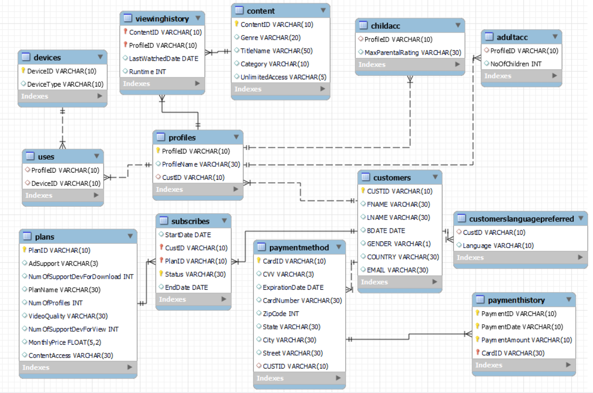

# 🎬 Netflix Data Analysis using SQL

<p align="center">


</p>

---

## 📖 Project Overview

Netflix is one of the world's largest streaming platforms, offering thousands of Movies and TV Shows across multiple genres, countries, and languages.

This project performs comprehensive data analysis on the Netflix dataset using **MySQL**, transforming raw data into meaningful business insights through advanced SQL queries.

The project demonstrates practical SQL concepts including **Joins, Common Table Expressions (CTEs), Window Functions, Aggregate Functions, String Functions, Date Functions, Ranking Functions, Views, and Subqueries**, making it an ideal portfolio project for Data Analyst roles.

---

## 🎯 Project Objectives

- Analyze Netflix content using SQL
- Perform data exploration and business analysis
- Practice beginner to advanced SQL concepts
- Solve real-world business questions
- Build a portfolio-ready SQL project
- Strengthen analytical and problem-solving skills

---

## 🛠 Tech Stack

| Technology | Purpose |
|------------|---------|
| 🗄 MySQL | Database Management |
| 💻 SQL | Data Analysis |
| 🛠 MySQL Workbench | Query Execution |
| 🌿 Git | Version Control |
| 📂 GitHub | Project Repository |

---

## 📂 Folder Structure

```text
Netflix-SQL-Data-Analysis/
│
├── Database/
│   └── Netflix_Database.sql
│
├── Netflix_SQL_Analysis.sql
│
├── images/
│   ├── er_diagram.png
│
└── README.md
```

---

# 📊 Dataset Overview

The dataset contains information about Netflix Movies and TV Shows, including:

- Show ID
- Title
- Type
- Director
- Cast
- Country
- Date Added
- Release Year
- Rating
- Duration
- Genre
- Description

---

# 🗂 Entity Relationship (ER) Diagram



---

## 🧠 SQL Concepts Covered

✔ SELECT Statements

✔ Filtering using WHERE

✔ ORDER BY

✔ GROUP BY

✔ HAVING Clause

✔ Aggregate Functions

✔ CASE Statements

✔ Date Functions

✔ String Functions

✔ NULL Handling

✔ DISTINCT

✔ INNER JOIN

✔ LEFT JOIN

✔ RIGHT JOIN

✔ SELF JOIN

✔ Common Table Expressions (CTEs)

✔ Window Functions

✔ Ranking Functions

✔ Subqueries

✔ Views

---

## 📈 Business Questions Solved

- Total Movies and TV Shows available on Netflix
- Movies vs TV Shows distribution
- Top countries producing Netflix content
- Most common content ratings
- Content added over time
- Year-wise content growth
- Most popular genres
- Longest Movies
- Directors with the highest number of releases
- Country-wise content availability
- Rating distribution analysis
- Release year trends
- Duration analysis
- Recently added content
- Top-performing genres

---

## 💡 Key Insights

- Movies account for the majority of Netflix's content library.
- The United States contributes the highest volume of content.
- Drama and International Movies dominate the platform.
- Netflix experienced rapid content growth after 2015.
- TV Show production has increased significantly in recent years.
- Most titles are rated for mature audiences.

---

## 📊 Skills Demonstrated

- SQL Query Writing
- Data Cleaning
- Data Exploration
- Business Analysis
- Data Aggregation
- Window Functions
- Common Table Expressions (CTEs)
- Data Transformation
- Analytical Thinking
- Database Query Optimization

---

## 💼 Business Use Cases

- Streaming Platform Analytics
- Content Performance Analysis
- Genre Popularity Analysis
- Regional Content Distribution
- Content Acquisition Strategy
- Entertainment Business Intelligence
- Customer Preference Analysis

---

## ✨ Repository Highlights

- End-to-End SQL Analysis Project
- Beginner to Advanced SQL Concepts
- Real-world Business Scenarios
- Well-Documented SQL Queries
- Interview Preparation Project
- Recruiter-Friendly Portfolio Project
- Clean Folder Structure
- Production-Style Documentation

---


**Sunidhi Chaudhary**

**Data Analyst**
